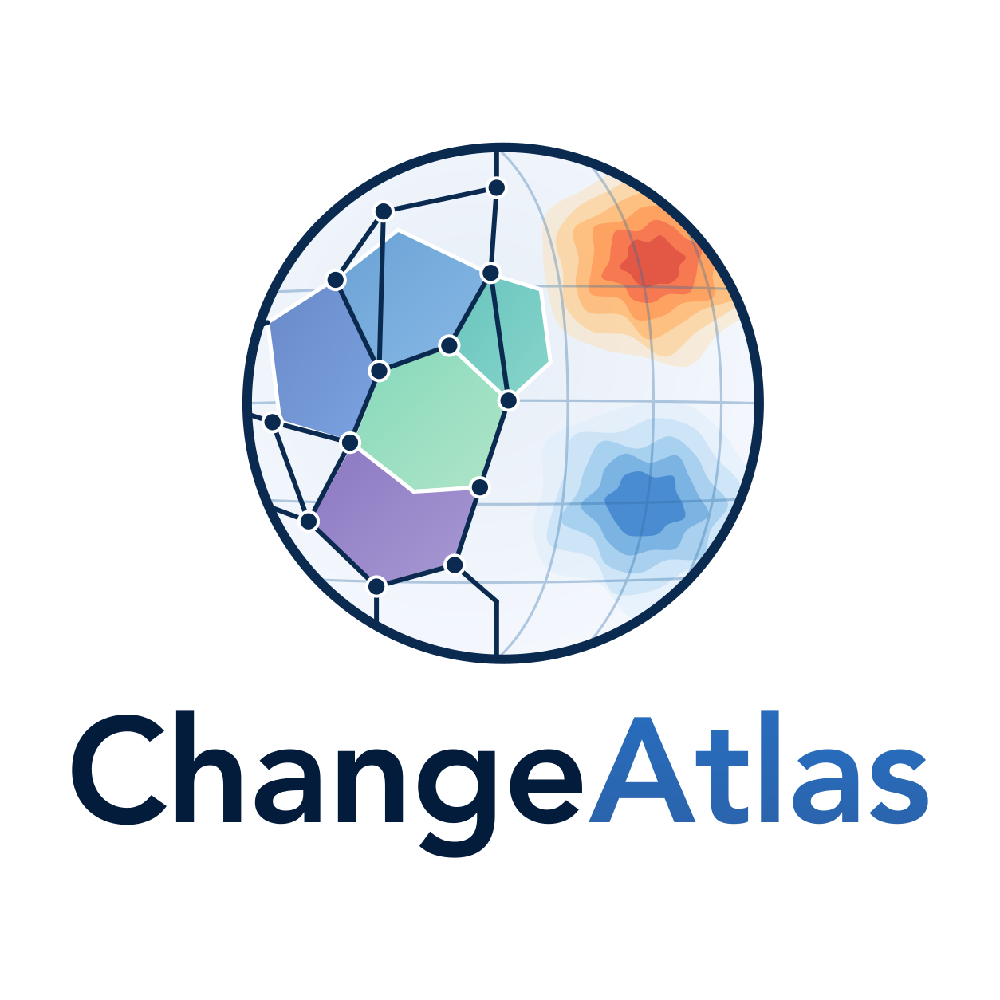
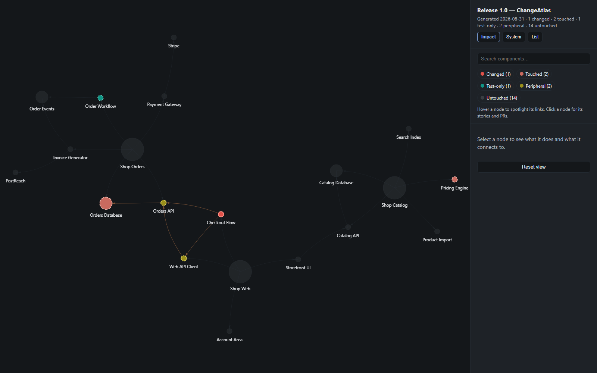

<p align="center">
  <picture>
    <source media="(prefers-color-scheme: dark)" srcset="changeatlas/logo-dark.svg">
    
  </picture>
</p>

[](https://github.com/jholsgrove/ChangeAtlas/actions/workflows/ci.yml)

ChangeAtlas turns a release's tracker query into a shaded map of your
software system. An AI agent builds the atlas of your system **once** — a
JSON graph of components and dependencies; after that, every release is
just weather painted on top by deterministic code: each shaded component
links straight to the exact work items and pull requests that touched it.

**[Live demo →](https://jholsgrove.github.io/ChangeAtlas/)** — the
fictional web-shop sample, clickable in your browser: theme toggle, legend
filters, list view, and Export to Obsidian all work. Rebuilt from `main` on
every push.

**[Large-system demo →](https://jholsgrove.github.io/ChangeAtlas/large/)** — the
same report on a fictional 100-repo retail platform (~1,500 components).
Above 150 components the report opens **grouped by repo**: repos with no
production or test evidence collapse into bubbles, a per-repo roll-up sits
in the side panel, and **Hide untouched** strips the map down to the
release. Toggle grouping off to see why the flat map stops working at this
scale. See **Large systems**, below.

<!--
  To regenerate docs/img/sample-map.png: run `python -m changeatlas --sample`,
  then screenshot out/impact-sample.html at 1600x1000 (headless works:
  msedge --headless=new --screenshot=docs/img/sample-map.png
  --window-size=1600,1000 --virtual-time-budget=10000 <file:// URL>).
-->


## Quickstart (zero setup)

No installs beyond Python 3.10+ — no pip packages, no CLI tools.

```sh
git clone https://github.com/jholsgrove/ChangeAtlas && cd ChangeAtlas
python -m changeatlas --sample
python -m changeatlas --sample large
```

Then open `out/impact-sample.html` in a browser. This renders the bundled
fictional web-shop sample (`sample/`) end to end, with zero ADO access.
`--sample large` renders the 100-repo sample (`sample/large/`) to
`out/impact-sample-large.html`; `--group-threshold N` (default 150) sets the
component count above which any report opens grouped by repo.

## Quickstart (Azure DevOps)

1. Get a PAT and set `CHANGEATLAS_TOKEN` — see [`docs/tokens.md`](docs/tokens.md).
2. Build your system's atlas once (see **The method**, below) so you have a
   `graph-data.json`.
3. Run:

```sh
python -m changeatlas --query <shared-query-url> --release 26.8 \
  --org https://dev.azure.com/<org> --project <project> \
  --graph-data <path/to/graph-data.json>
```

`<shared-query-url>` is the URL of an ADO shared query returning the
release's work items. The result is cached to
`out/release-26.8-data.json`; re-running without `--refresh` reuses it.

## The method

1. **Scan the system, once.** Point your own AI agent (Claude Code, Cursor,
   Copilot Chat, whatever you use) at your repos with
   [`prompts/scan-system-map.md`](prompts/scan-system-map.md). It scans
   plumbing — not business logic — and produces `graph-data.json`: the
   node/edge graph documented in
   [`docs/graph-schema.md`](docs/graph-schema.md). Curate it by hand
   afterwards; it's checked in and ChangeAtlas never regenerates it.
2. **Map changed files to the graph, once.** Use
   [`prompts/build-glob-map.md`](prompts/build-glob-map.md) to produce
   `config/component-globs.json`, which tells ChangeAtlas which changed
   file paths belong to which node. Validate with
   `python -m changeatlas --check-map --graph-data <path>` and fix what it
   reports.
3. **Render a release, every release.** Point ChangeAtlas at a release's
   work items (Azure DevOps out of the box, or any tracker via
   `out/release-<label>-data.json` — see **Other trackers** below) and it
   shades the map deterministically — no AI involved at render time.

## Other trackers

ChangeAtlas ships an Azure DevOps gatherer, but any tracker works: produce
`out/release-<label>-data.json` in the documented shape (any language, any
method — a script, a manual export) and render it with no query and no
token:

```sh
python -m changeatlas --release <label> --graph-data <path/to/graph-data.json>
```

The full contract, field meanings, and a worked example are in
[`docs/release-data-schema.md`](docs/release-data-schema.md).
[`prompts/build-gatherer.md`](prompts/build-gatherer.md) is an AI prompt for
writing the glue script against your tracker (and your git host's API, if
it's a different product).

## Tier semantics

Each node on the map ends up in exactly one of these states, decided by
**production files only** (test files never push a node into `changed` or
`touched`):

| Tier | Colour | Meaning |
|---|---|---|
| Changed | Red | ≥ `--changed-threshold` (default 3) production files matched the node. |
| Touched | Pale red | 1 to (`--changed-threshold` − 1) production files matched the node. |
| Test-only | Teal | Only test files matched the node — no production evidence at all. |
| Peripheral | Amber | A direct, non-repo neighbour of a `changed` node in the graph (one edge away) — not itself modified, but worth a look. |
| Untouched | Dimmed | Nothing matched. |

`--changed-threshold` tunes where "touched" ends and "changed" begins;
lower it for a smaller codebase where fewer changed files should already
read as significant.

Rules that deliberately don't shade or spread, by design:

- **Dependency-manifest files never count as evidence.** Lockfiles and
  project files (which ones, per ecosystem, is configurable — see
  **Heuristics presets** below) are skipped entirely; a NuGet version bump
  alone never shades a node.
- **Database nodes shade only on schema evidence** — migrations, `.sql`
  files, model snapshots — never on ordinary data-access code changes, and
  a database node is **never** marked peripheral even when a directly
  connected node changes.
- **Repo nodes' catch-all glob doesn't spread the peripheral ring.** A
  repo's own graph node never enters a tier, and an edge to/from a repo
  node is ignored when computing which neighbours go peripheral — only
  edges between finer-grained nodes do.

## Accessibility

The rendered HTML targets **WCAG 2.2 AA**. A canvas graph can't itself be
made accessible, so conformance comes from an equivalent view plus the page
around the canvas:

- **List view** — a keyboard-navigable, tier-grouped table of every
  impacted component (component, tier, production/test file counts,
  stories, PRs, all as real links), toggleable from the page header. This
  is the text alternative to the canvas and the keyboard-only path through
  the same data.
- **Non-colour tier coding** — every tier also carries a distinct node
  border pattern on the canvas and a text label in the legend, the details
  panel, and the list view, so tier is never conveyed by colour alone.
- **Contrast-audited palette** — text and tier-fill colours are checked
  against WCAG's 4.5:1 (text) and 3:1 (graphical objects) thresholds; these
  checks are enforced by the test suite (`tests/test_palette.py`), not just
  eyeballed once.
- **Focus management** — opening a node's details panel moves focus into
  it; closing (via `Esc` or the close control) returns focus to where it
  was; all interactive elements have visible focus indicators.

## Heuristics presets

File classification (what counts as a dependency manifest, a test file, or
database schema evidence) is configuration, not hardcoded logic, so it can
match different ecosystems:

```sh
python -m changeatlas ... --heuristics dotnet
python -m changeatlas ... --heuristics generic   # default
python -m changeatlas ... --heuristics /path/to/custom-heuristics.json
```

`generic` (the default) covers common cross-ecosystem lockfiles
(`package-lock.json`, `yarn.lock`, `poetry.lock`, `Cargo.lock`, `go.sum`,
…). `dotnet` covers .NET-specific manifests (`packages.config`,
`*.csproj`, `Directory.Build.props`, …). Write your own JSON file in the
same shape (see `config/heuristics/generic.json`) for anything else.

`test_markers` match as a **substring within a path segment**, not a whole
segment — so a marker like `"test"` also matches a segment such as
`"latest"` or `"attestation"`. This is deliberate (inherited behaviour),
trading a few false positives for never missing a differently-named test
folder; tune it in a custom heuristics file if your codebase needs
tighter matching.

## Large systems

Readability depends on how many *untouched* nodes are drawn, not on the
size of the atlas. Above `--group-threshold` components (default 150) the
report opens grouped by repo: every repo with no changed, touched or
test-only component is one bubble labelled with its name and component
count (an amber dashed ring means it contains a peripheral neighbour, and
the label says how many). Click a bubble to open it; click the repo node
inside an open group to close it. **Hide untouched** removes untouched
nodes from the layout altogether, including the bubbles of repos with
nothing in the release, and pulls what is left together so the survivors
fill the viewport instead of sitting at the far corners of the full map
(toggle it off and the map spreads out again, settling near, not exactly
on, its old positions). Both are toggles in the side panel, work
on any report, and never change the tier counts, the List view or the
exports — the Obsidian vault is always the full atlas, and Export PNG is
whatever is on screen. The grouping choice is remembered per browser, per
atlas size.

## Anonymised demos

```sh
python -m changeatlas ... --anonymize
```

Writes `out/impact-<release>-anon.html` instead of the real output:
generic node/story/PR names, and dead pull-request/work-item links on the
reserved `.example` TLD (they look real on hover but can never resolve to,
or leak, a real organisation). Topology, node types, tiers, and change
sizes are preserved — this is for sharing a real release's *shape* without
sharing its content.

## License

MIT — see [`LICENSE`](LICENSE). The vendored `vis-network` (in `vendor/`)
is MIT/Apache-2.0 dual-licensed — see
[`vendor/LICENSE-vis-network`](vendor/LICENSE-vis-network).
